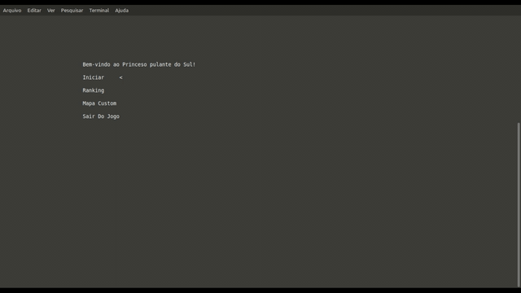

# Trabalho final de Programação de Computadores

Universidade Federal de Pelotas - UFPEL
Autores: Eduardo, Hector, Mauricio, William

Jogo simples feito em c.
1. Baixe a biblioteca [rlutil.h](http://tapiov.net/rlutil/) e coloque na pasta `bibliotecas`
2. Para executar, acesse a pasta raiz pelo terminal e execute o comando: `make`  
3. O arquivo main será criado, logo em seguida execute: `./main`  
4. O jogo será executado.

